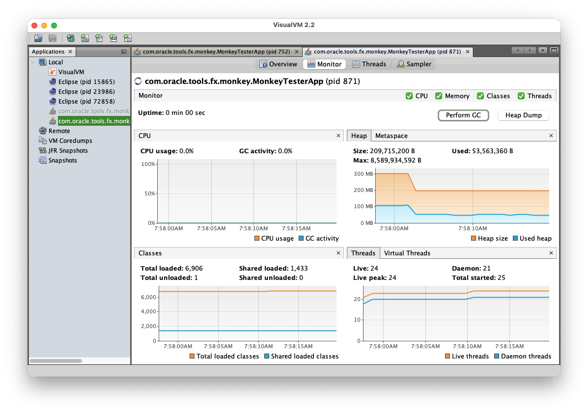

# Node Properties Storage Experiment

Andy Goryachev

<andy.goryachev@oracle.com>


## Summary

Place rarely used properties in the `Node` class into a fast, compact, map-like container,
resulting in reduction of memory footprint of over 500 bytes per a `Node` instance.


## Goals

The goal is to reduce the memory footprint and, to a lesser extent,
the garbage collection (GC) overhead of JavaFX applications.

The reduced memory footprint and CPU requirements might be especially beneficial in
resource constrained environments such as iOS / Android / RaspberryPi devices.


## Non-Goals

The following are out of scope for this proposal:

- applying the same solution to other frequently used classes such as `Region` or `Labeled`
- provide public API


## Success Metrics

The main impact is a reduction of memory footprint that can be measured using the VisualVM tool immediately following
the garbage collection cycle.


## Motivation

The Node class is the base class for scene nodes in JavaFX.  It is currently declares about 80 properties
most of which are either not set or set to the default value.

The original JavaFX developers realized this fact and tried to minimize the memory footprint by using two
techniques:

1. lazy instantiation of properties
2. placing groups of properties into related "buckets" like `AccessibilityProperties`, `MiscProperties`,
`EventHandlerProperties` etc.

There is some doubt, however, about whether this produced the desired saving - because setting or requesting a single property
in the bucket leads to allocation of the entire bucket.

Instead, we first collect the usage statistics using available applications
(the Monkey Tester [0] and the RichEditorDemo [1]).
The data obtained in this step allows us to decide which
properties need to be declared in the object itself, and which can be placed into a container.


## Description

As of jfx26, the `Node` class declares 78 properties:

```
accessibleHelp
accessibleRole
accessibleRoleDescription
accessibleText
blendMode
cache
cacheHint
clip
cursor
depthTest
disable
disabled
effect
eventDispatcher
focusTraversable
hover
id
inputMethodRequests
layoutX
layoutY
managed
mouseTransparent
nodeOrientation
onContextMenuRequested
onDragDetected
onDragDone
onDragDropped
onDragEntered
onDragExited
onDragOver
onInputMethodTextChanged
onKeyPressed
onKeyReleased
onKeyTyped
onMouseClicked
onMouseDragDone
onMouseDragEntered
onMouseDragExited
onMouseDragged
onMouseDragOver
onMouseDragReleased
onMouseEntered
onMouseExited
onMouseMoved
onMousePressed
onMouseReleased
onRotate
onRotationFinished
onRotationStarted
onScroll
onScrollFinished
onScrollStarted
onSwipeDown
onSwipeLeft
onSwipeRight
onSwipeUp
onTouchMoved
onTouchPressed
onTouchReleased
onTouchStationary
onZoom
onZoomFinished
onZoomStarted
opacity
pickOnBounds
pressed
rotate
rotationAxis
scaleX
scaleY
scaleZ
showMnemonics
style
translateX
translateY
translateZ
viewOrder
visible
```

In order to collect the usage data, a subset of these properties was refactored to be stored in a per instance
container implemented by the `FastMap` class [2].

Briefly, the changes are:

- add the property container `private final FastMap props`
- declare a private static final key corresponding to each property to be moved to the container
- replace pointer dereference with `FastMap.get(PKey<?>)`
- replace property instantiation with a call to `FastMap.init()`

To illustrate, here is an example using the `onTouchMoved` property:

```
    private static final PKey<EHProperty<TouchEvent>> K_ON_TOUCH_MOVED = new PKey<>();
    
    private final FastMap props = FastMap.create(this, Node.class);
    
    public final ObjectProperty<EventHandler<? super TouchEvent>> onTouchMovedProperty() {
        EHProperty<TouchEvent> p = props.get(K_ON_TOUCH_MOVED);
        if (p == null) {
            p = props.init(K_ON_TOUCH_MOVED, () -> new EHProperty<>("onTouchMoved", TouchEvent.TOUCH_MOVED));
        }
        return p;
    }

    public final EventHandler<? super TouchEvent> getOnTouchMoved() {
        EHProperty<TouchEvent> p = props.get(K_ON_TOUCH_MOVED);
        return (p == null) ? null : p.get();
    }
```

The implementation of `FastMap` stores the keys and properties in two small `ArrayList`s -
one for keys (statically declared `PKey` constants), the other for property instances.
performing a linear lookup of the property index using the key.

The small arrays increase probability of them fitting into a single cache block - that, coupled with the
fact that comparison is done with `==` operator, makes the process extremely fast.  It is likely to be faster than
using a `HashMap` because there is no need to compute `hashCode()`.


### Instrumentation

The JavaFX code is available on the `linear.instrumented` branch [3].  This code is instrumented to periodically dump the usage statistics
to `stdout`.  Since the instrumentation may slightly impact the performance, it can be disabled by setting
`FastMap.COLLECT_STATISTICS` to `false`.


### Test Results

Initially, the tests were conducted using a subset of 71 properties with
the Monkey Tester [0] and the RichEditorDemo [1] applications.

Below is an example of usage statistics collected in the Monkey Tester's RichTextArea page,
with line numbers option and the Java syntax highlighter enabled, and the contents of
Node.java (approximately 10.5 kloc) pasted:

```
Nodes=12,020 utilization=0.056 average=3.99 top=26 indexOf=38,359,120 saved=6,443,720 bytes
   Node.K_ACCESSIBLE_ROLE: 11806
   Node.K_DISABLED: 11735
   Node.K_LAYOUT_X: 9934
   Node.K_LAYOUT_Y: 9790
   Node.K_FOCUS_TRAVERSABLE: 1794
   Node.K_VISIBLE: 787
   Node.K_ON_MOUSE_PRESSED: 340
   Node.K_ON_MOUSE_RELEASED: 259
   Node.K_ID: 170
   Node.K_EFFECT: 165
   Node.K_CLIP: 137
   Node.K_ON_SCROLL: 121
   Node.K_TRANSLATE_X: 115
   Node.K_TRANSLATE_Y: 114
   Node.K_HOVER: 113
   Node.K_ON_MOUSE_DRAGGED: 86
   Node.K_ON_SCROLL_STARTED: 82
   Node.K_MOUSE_TRANSPARENT: 79
   Node.K_ON_INPUT_METHOD_TEXT_CHANGED: 62
   Node.K_INPUT_METHOD_REQUESTS: 40
   Node.K_ON_TOUCH_RELEASED: 39
   Node.K_ON_TOUCH_PRESSED: 39
   Node.K_ON_KEY_PRESSED: 38
   Node.K_CURSOR: 32
   Node.K_BOUNDS_IN_LOCAL: 31
   Node.K_NODE_ORIENTATION: 21
   Node.K_DISABLE: 7
   Node.K_ON_MOUSE_ENTERED: 6
   Node.K_VIEW_ORDER: 4
   Node.K_CACHE: 2
   Node.K_ACCESSIBLE_ROLE_DESCR: 1
   Node.K_TRANSLATE_Z: 1
   Node.K_ACCESSIBLE_TEXT: 1
   Node.K_ACCESSIBLE_HELP: 1
   Node.K_BLEND_MODE: 1
   Node.K_ON_DRAG_DETECTED: 1
   Node.K_CACHE_HINT: 1

    0: 127
    1: 42
    2: 1585
    3: 155
    4: 7735
    5: 1723
    6: 150
    7: 354
    8: 26
    9: 112
   10: 7
   11: 3
   26: 1
```

One can see that out of 12,020 in memory, we have an average of 3.99 properties allocated per node,
with the maximum number of allocated properties at 26, and estimated savings of 6,443,720 bytes.

It is immediately apparent that the following four properties are almost always allocated, which roughly corresponds
to the number of 4 properties per node on average:

```
   Node.K_ACCESSIBLE_ROLE: 11806
   Node.K_DISABLED: 11735
   Node.K_LAYOUT_X: 9934
   Node.K_LAYOUT_Y: 9790
```

The frequency histogram shows that the most frequent situation is 4 properties per node (7735 instances).
Surprisingly, there is 127 nodes where no properties allocated at all.

Running several other pages in the Monkey Tester and the RichEditorDemo application showed similar distribution.

Using this data, it was decided to allocate the four top properties as regular instance fields, reducing the subset
to 67 properties.
This code is available in the `linear.faster` branch [4].

Two scenarios were captured: the first after scrolling the text up and down several times (which creates a large amount
nodes cached in memory), followed by the explicit garbage collection cycle using VisualVM tool.

The first scenario:

```
Nodes=42,997 utilization=0.003 average=0.193 top=22 indexOf=31,297,982 saved=22,979,880 bytes
   Node.K_FOCUS_TRAVERSABLE: 5405
   Node.K_VISIBLE: 787
   Node.K_ON_MOUSE_PRESSED: 340
   Node.K_ON_MOUSE_RELEASED: 259
   Node.K_ID: 170
   Node.K_EFFECT: 165
   Node.K_CLIP: 137
   Node.K_HOVER: 127
   Node.K_ON_SCROLL: 121
   Node.K_TRANSLATE_X: 115
   Node.K_TRANSLATE_Y: 114
   Node.K_ON_MOUSE_DRAGGED: 86
   Node.K_ON_SCROLL_STARTED: 82
   Node.K_MOUSE_TRANSPARENT: 79
   Node.K_ON_INPUT_METHOD_TEXT_CHANGED: 62
   Node.K_INPUT_METHOD_REQUESTS: 40
   Node.K_ON_TOUCH_PRESSED: 39
   Node.K_ON_TOUCH_RELEASED: 39
   Node.K_ON_KEY_PRESSED: 38
   Node.K_CURSOR: 32
   Node.K_BOUNDS_IN_LOCAL: 31
   Node.K_NODE_ORIENTATION: 20
   Node.K_DISABLE: 7
   Node.K_ON_MOUSE_ENTERED: 6
   Node.K_VIEW_ORDER: 4
   Node.K_CACHE: 2
   Node.K_BLEND_MODE: 1
   Node.K_ACCESSIBLE_ROLE_DESCR: 1
   Node.K_ACCESSIBLE_HELP: 1
   Node.K_ACCESSIBLE_TEXT: 1
   Node.K_TRANSLATE_Z: 1
   Node.K_CACHE_HINT: 1
   Node.K_ON_DRAG_DETECTED: 1

    0: 36595
    1: 5541
    2: 290
    3: 413
    4: 27
    5: 41
    6: 6
    7: 81
    8: 2
   22: 1
```

The second scenario, after GC:

```
Nodes=3,633 utilization=0.014 average=0.963 top=22 indexOf=439,833 saved=1,919,296 bytes
   Node.K_VISIBLE: 787
   Node.K_FOCUS_TRAVERSABLE: 688
   Node.K_ON_MOUSE_PRESSED: 340
   Node.K_ON_MOUSE_RELEASED: 259
   Node.K_ID: 170
   Node.K_EFFECT: 165
   Node.K_CLIP: 137
   Node.K_ON_SCROLL: 121
   Node.K_TRANSLATE_X: 115
   Node.K_TRANSLATE_Y: 114
   Node.K_ON_MOUSE_DRAGGED: 86
   Node.K_ON_SCROLL_STARTED: 82
   Node.K_MOUSE_TRANSPARENT: 79
   Node.K_ON_INPUT_METHOD_TEXT_CHANGED: 62
   Node.K_INPUT_METHOD_REQUESTS: 40
   Node.K_ON_TOUCH_PRESSED: 39
   Node.K_ON_TOUCH_RELEASED: 39
   Node.K_ON_KEY_PRESSED: 38
   Node.K_CURSOR: 32
   Node.K_BOUNDS_IN_LOCAL: 31
   Node.K_HOVER: 29
   Node.K_NODE_ORIENTATION: 20
   Node.K_DISABLE: 7
   Node.K_ON_MOUSE_ENTERED: 6
   Node.K_VIEW_ORDER: 4
   Node.K_CACHE: 2
   Node.K_BLEND_MODE: 1
   Node.K_ACCESSIBLE_ROLE_DESCR: 1
   Node.K_ACCESSIBLE_HELP: 1
   Node.K_ACCESSIBLE_TEXT: 1
   Node.K_TRANSLATE_Z: 1
   Node.K_CACHE_HINT: 1
   Node.K_ON_DRAG_DETECTED: 1

    0: 2000
    1: 800
    2: 268
    3: 414
    4: 22
    5: 39
    6: 7
    7: 82
   22: 1
```

Additionally, here are VisualVM memory screenshots illustrating memory consumption before and
after the `Perform GC` button is pressed:

Without changes:


With 67 properties migrated to use the container:




### Discussion

Looking at the test results above, I think we can come to a conclusion that this proposal does indeed
provide a saving of ~520 bytes per `Node` instance, which translates into overall saving of several megabytes
for a typical application of moderate complexity.

Surprisingly, a large number of instances exhibit 0 allocated properties, so perhaps the `props` container itself 
can be lazily instantiated.

I encourage everyone to test their JavaFX application with one of the branches and observe:

- the reduction of memory footprint or lack thereof
- any changes in performance 
- any differences in the usage statistics


## Alternatives

One alternative is do nothing and leave everything as is.

Since this is an internal implementation optimization, we might explore a number of possibilities:

- use arrays instead of `ArrayList` to control the array growth (for example, add +2 to the size on each overflow)
- use one array for both keys and properties, at the expense of having more cache misses
- allow subclasses such as `Region` to use the `Node`'s property container
- given large number of nodes with no properies allocated, lazily allocate the property container itself


## Testing

TODO


## Risks and Assumptions

- the main assumption is that all access to the properties is single-threaded, which is the same as the existing
requirement.

- possibility of copy-paste errors introduced during code review, such as using the wrong key for a property,
or creating a property instance without placing it into the container (i.e. missing `FastMap.init()` ).


## Dependencies

None.


## References

[0] https://github.com/andy-goryachev-oracle/MonkeyTest/

[1] https://github.com/openjdk/jfx/blob/master/apps/samples/RichTextAreaDemo/src/com/oracle/demo/richtext/editor/RichEditorDemoApp.java

[2] https://github.com/andy-goryachev-oracle/jfx/blob/linear.instrumented/modules/javafx.graphics/src/main/java/com/sun/javafx/util/FastMap.java

[3] https://github.com/andy-goryachev-oracle/jfx/tree/linear.instrumented

[4] https://github.com/andy-goryachev-oracle/jfx/tree/linear.faster
