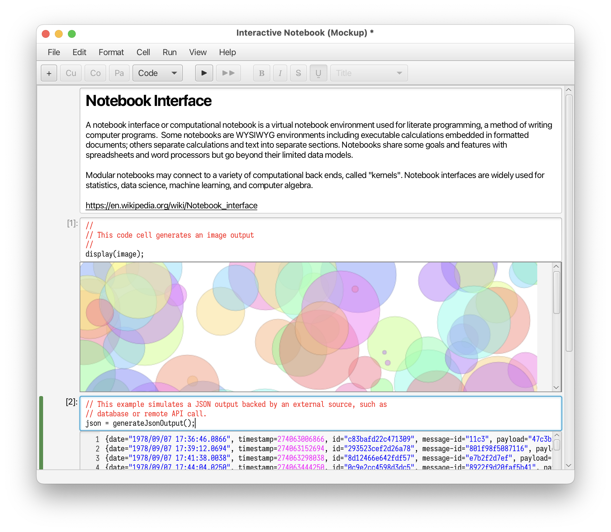

# Notebook GUI Demo Using CodeArea

This project demonstrate some capabilities of the RichTextArea/CodeArea controls, being developed as a part of the
[RichTextArea](https://github.com/openjdk/jfx/pull/1524) incubator module [1], [2].

## Features

- interactive cells with rich text
- output cells containing rich text or interactive controls
- self-contained application

## Code

Please see [NotebookMockupApp.java](src/com/oracle/demo/richtext/notebook/NotebookMockupApp.java)

Until the incubator module is integrated, this project requires the full [jfx](https://github.com/openjdk/jfx)
build from the following branch [8301121.RichTextArea](https://github.com/andy-goryachev-oracle/jfx/tree/8301121.RichTextArea).

## References

1. [JDK-8301121](https://bugs.openjdk.org/browse/JDK-8301121) RichTextArea Control (Incubator)
2. [#1524](https://github.com/openjdk/jfx/pull/1524) Pull Request