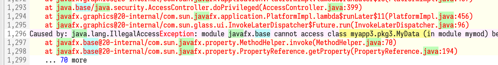

# Rich Text Area Control (Incubator)

Andy Goryachev

<andy.goryachev@oracle.com>


## Summary

Provide a RichTextArea control for displaying and editing of rich text that can be styled in a variety of ways.




## Goals

Out of the box, the **RichTextArea** control provides support for a number of common use cases:

- read-only presentation of rich text information (help pages, documentation, etc.)
- a simple editor similar to WordPad or TextEdit level, suitable for note taking or message editing.
- a code editor with syntax highlighting
- an editor which combines rich text with interactive content, such as a code notebook
- enable extension and customization using via the input map


## Non-Goals

The following list represents features RichTextArea does not support:

- models with arbitrarily long (e.g., 10K+ symbols) paragraphs
- applications requiring arbitrary text/graphics positioning
- desktop publishing application that require precise control of text appearance
- multiple or rectangular selection segments
- embedded tables


## Motivation

JavaFX lacks a dedicated rich text area control, resulting in a functional gap in relation to Swing with its StyledEditorKit/JEditorPane.  

The new RichTextArea control intends to bridge this gap by providing a dedicated control for displaying and editing rich text.

The main design goal is to provide a control that is complete enough to be useful out-of-the box, as well as open to extension by the application developers.  The benefit of providing such a control as a part of the core platform is not just adding support for rich text, but also in taking care of many intricate details required for such support, making it easier for third party developers who decide to extend the basic functionality.

Creating a simple editable control should be as easy as this:

```java
        RichTextArea t = new RichTextArea();
```

Creating a read-only informational control should also be easy:

```java
        SimpleReadOnlyStyledModel m = new SimpleReadOnlyStyledModel();
        // add text segment using CSS style name (requires a style sheet)
        m.addSegment("RichTextArea ", null, "HEADER");
        // add text segment using direct style
        m.addSegment("Demo", "-fx-font-size:200%;", null);
        // newline
        m.nl();

        RichTextArea t = new RichTextArea(m);
```


## Description

Two new controls are provided: **RichTextArea** and **CodeArea**.  RichTextArea works with styled text and embedded Nodes, whereas CodeArea is limited to plain text documents using single font, which allows for syntax highlighting.

The data model (document) is separated from the control, allowing for greater flexibility.  **EditableRichTextModel** is a default model for RichTextArea, **CodeTextModel** is a default model for CodeArea.

The following diagram illustrates the logical relationship between important classes:

```
RichTextArea                   control
 ├─ TextPos                    immutable text position
 ├─ SelectionSegment           single selection segment (two markers)
 │   └─ Marker                 moveable text position within the document
 │
 ├─ StyledTextModel            document data model
 │   ├─ RichParagraph          presents the paragraph contents to view
 │   │   ├─ StyleAttrs         immutable map of style attributes 
 │   │   ├─ StyledSegment      immutable styled segment
 │   └─ DataFormatHandler      converter for import/export/clipboard operations
 │       ├─ StyledInput        input stream of StyledSegments
 │       ├─ StyledOutput       output stream of StyledSegments
 │       └─ StyleResolver      converts external CSS styles to attributes
 │
 └─ RichTextAreaSkin           default skin
     └─SideDecorator           right/left paragraph decorator factory
```

CodeArea extends RichTextArea and brings a few additional classes into the picture:

```
CodeArea                       control, extends RichTextArea
 ├─ CodeTextModel              document model
 └─ SyntaxDecorator            interface which provides styling for underlying plain text
```

The code is currently being incubated in the **javafx.incubator.controls module**.
While this document makes an attempt to give an overview of various parts, please refer to the
[API Specification](javadoc/javadoc.zip) for more detail.


### Design Principles

- paragraph-oriented model, up to ~2 billion rows
- virtualized text cell flow
- supports text styling with an application stylesheet or inline attributes
- supports multiple views connected to the same model
- single selection
- input map allows for easy behavior extension


### RichTextArea Properties

The new **RichTextArea** control exposes the following properties:

|Property |Description |Styleable|
|:--------|:-----------|:--------|
|anchorPosition	|provides the anchor position (read-only)	
|caretBlinkPeriod	|determines the caret blink rate	
|caretPosition	|provides the caret position (read-only)	
|contentPadding	|defines the amount of padding in the content area	|Yes
|displayCaret	|indicates whether the caret is displayed	
|editable	|indicates whether the editing is enabled	
|highlightCurrentParagraph	|indicates whether the current paragraph is highlighted
|leftDecorator	|specifies the left side paragraph decorator
|model	|document data model	
|rightDecorator	|specifies the right side paragraph decorator
|selectionSegment	|tracks the selection segment (read-only)
|useContentHeight	|determines whether the preferred height is the same as the content height
|useContentWidth	|determines whether the preferred width is the same as the content width
|wrapText	|indicates whether text should be wrapped	|Yes


### Model

The RichTextArea control separates data model from the view by providing the **model** property.

The base class for any data model is **StyledTextModel**.  This abstract class provides no data storage, focusing instead on providing common functionality to the actual models, such as dealing with styled segments, keeping track of markers, sending events, etc.


#### Standard Models

A number of standard models is included, designed for a specific use case, as described in this table:

|Class Name	|Description
|:---|:---|
|`StyledTextModel`	|Base class
|` ├─ EditableRichTextModel`	|Default model for RichTextArea
|` ├─ BasePlainTextModel`	|Base class for models based on plain text
|` │   └─ CodeTextModel`	|Default model for CodeArea
|` └─ StyledTextModelReadOnlyBase`	|Base class for a read-only model
|`     └─ SimpleReadOnlyStyledModel`	|In-memory read-only styled model

The **EditableRichTextModel** stores the data in memory, in the form of text segments styled with attributes defined in **StyleAttrs** class.  This is a default model for RichTextArea.

The abstract **BasePlainTextModel** is a base class for in-memory text models based on plain text.  This class provides foundation for the **CodeTextModel**, which styles the text using a pluggable **SyntaxDecorator**.

The abstract **StyledTextModelReadOnlyBase** is a base class for read-only models.  This class is used by **SimpleReadOnlyStyledModel** which simplifies building of in-memory read-only styled documents.


#### Read-Only Models

A read-only model can be used to present rich text document not editable by the user (for example, a help or an informational page, or a virtualized view backed by a large file).

**SimpleReadOnlyStyledModel** is suitable for a small in-memory styled document.  This model provides a number of methods to populate the document one segment at a time:

- addSegment(String)
- addSegment(String text, String style, String ... styleNames)
- addSegment(String, StyleAttrs)

Other methods allow for adding image paragraphs, embedded Nodes, paragraph containing a single Region, as well as various types of highlights:

- addImage(InputStream)
- addNodeSegment(Supplier<Node>)
- addParagraph(Supplier<Region>)
- highlight(int start, int length, Color)
- nl()
- nl(int)
- setParagraphAttributes(StyleAttrs)
- squiggly(int start, int length, Color)

An example of how to pre-populate the SimpleReadOnlyStyledModel is provided in the "Motivation" section.


The abstract base class **StyledTextModelReadOnlyBase** can be used in circumstances when the data is either too large to be stored in memory, such as a large file, or where data is generated on the fly.

In this case, three abstract methods must be implemented:

- int size()
- String getPlainText(int)
- RichParagraph getParagraph(int) 

A **RichParagraph** represents a paragraph with rich text.  As an immutable class, it has to be built using the **RichParagraph.Builder** which offers a number of methods which help construct and style the content:

- addHighlight(int, int, Color) 
- addInlineNode(Supplier<Node>)
- addSegment(String)
- addSegment(String text, String inlineStyle, String[] styles)
- addSegment(String text, StyleAttrs)
- addSquiggly(int, int, Color)
- setParagraphAttributes(StyleAttrs)

Below is an example which illustrates the usage of RichParagraph.Builder by generating a demo paragraph on the fly:

```java
    @Override
    public RichParagraph getParagraph(int ix) {
        RichParagraph.Builder b = RichParagraph.builder();
        String s = format.format(ix + 1);
        String sz = format.format(size);
        String[] css = monospaced ? new String[] { "monospaced" } : null;

        b.addSegment(s, "-fx-fill:darkgreen;", css);
        b.addSegment(" / ", null, css);
        b.addSegment(sz, "-fx-fill:black;", css);
        if (monospaced) {
            b.addSegment(" (monospaced)", null, css);
        }

        if ((ix % 10) == 9) {
            String words = generateWords(ix);
            b.addSegment(words, null, css);
        }
        return b.build();
    }
```


#### Editing

All the content modifications are channeled through two methods in the StyledTextModel:

- replace(StyleResolver, TextPos start, TextPos end, StyledInput, boolean createUndo)
- applyStyle(TextPos start, TextPos end, StyleAttrs, boolean mergeAttributes)

Once the model applies the changes, a corresponding event is broadcast to all the listeners registered with the model - one such listener is the skin, which in turn updates the scene graph by requesting new RichParagraphs within the affected range of text.

At the control level, RichTextArea provides a number of convenience methods for editing the content programmatically:

- appendText(String, StyleAttrs)
- appendText(StyledInput)
- applyStyle(TextPos start, TextPos end, StyleAttrs)
- clear()
- insertText(TexPos start, String, StyleAttrs)
- insertText(TextPos start, StyledInput)
- replaceText(TextPos start, TextPos end, StyledInput, boolean createUndo)
- setStyle(TextPos start, TextPos end, StyleAttrs)

The following example illustrates how to populate an editable RichTextArea programmatically:

```java
        // create styles
        StyleAttrs heading = StyleAttrs.builder().setBold(true).setFontSize(24).build();
        StyleAttrs plain = StyleAttrs.builder().setFontFamily("Monospaced").build();

        RichTextArea rta = new RichTextArea();
        // build the content
        rta.appendText("Heading\n", heading);
        rta.appendText("Plain monospaced text.\n", plain);
```


#### Styling

There are two ways of styling text in RichTextArea: either using inline attributes, or relying on style names in the application style sheet.  It is important to understand the limitation of stylesheet approach as it is only suitable for read-only models because editing of styles by the user is nearly impossible given the static nature of the application stylesheet.  (An example provided earlier illustrates how to style a read-only document using SimpleReadOnlyStyledModel and an application stylesheet).

The default model for RichTextArea, EditableRichTextModel, utilizes a number of style attributes (found in StyleAttrs class).  These attributes are applicable either to the whole paragraph (BACKGROUND, BULLET, FIRST_LINE_INDENT, ...) or to the individual text segments (BOLD, FONT_FAMILY, etc.).


#### Export/Import

StyledTextModel provides a common mechanism for importing/exporting styled text into/from the model via the following methods:

- exportText(TextPos start, TextPos end, StyledOutput out)
- TextPos replace(StyleResolver, TextPos start, TextPos end, String text, boolean createUndo)
- TextPos replace(StyleResolver, TextPos start, TextPos end, StyledInput in, boolean createUndo)

The I/O classes **StyledInput** and **StyledOutput** provide the transport of individual **StyledSegment**s.


#### Clipboard

The StyledTextModel provides capability to copy to and paste from the system clipboard in a variety of formats.  Please refer to the **DataFormatHandler** class hierarchy.

The default model, EditableRichTextModel, copies plain text, HTML, RTF, as well as the data in an internal format.  It also supports pasting plain text and internal formatted data, as well as a limited support for pasting RTF.

At the control level, save() and load() methods allow for data transfer using any of the data formats supported by the underlying model.


### Skin

The default skin, implemented by the **RichTextAreaSkin** class, provides the visual representation of RichTextArea control
 (i.e. represents a "View" in the MVC paradigm).

The main feature of the default skin is a virtualized text flow, where only a small number of paragraphs is laid out in a sliding window, enabling visualization and even editing of large models.

The size of the sliding window slightly exceeds the visible area, resulting in improved scrolling experience when paragraph heights differ.


#### Selection

RichTextArea control maintains a single contiguous selection segment, represented by the **selectionSegment** property.  Selection is ultimately linked with the View, to enable multiple controls working off the same data model to have their own selection.

Selection is determined by two positions: the anchor and the caret.  The anchor comes into play when the user updates selection by pressing and holding the SHIFT key, and the caret is the position visually identified by a blinking caret.  Selection segments uses the **Marker** class which updates the actual position in the presence of edits (such as edits made by the user in another view, or by a background process).

RichTextArea control provides a number of convenience methods to change selection programmatically:

- extendSelection(TextPos)
- select(TextPos, TextPos)
- selectAll()
- selectDocumentEnd()
- selectDocumentStart()
- selectDown
- selectEndOfNextWord()
- selectLeft()
- selectLeftWord()
- selectNextWord()
- selectPageDown()
- selectPageUp()
- selectParagraph()
- selectPreviousWord()
- selectRight()
- selectRightWord()
- selectUp()
- selectWord()
- setCaret(TextPos)


### Behavior

RichTextArea control utilizes the new capabilities offered by the new **InputMap** feature.  In this design, the control exposes a number of function tags identifying the public methods that convey the behavior.  There is one public method that corresponds to each function tag, allowing for customization of the behavior when required.

The table below lists the available function tags:

|Function Tag|Description|
|:-----------|:----------|
|BACKSPACE	|Deletes the symbol before the caret position
|COPY	|Copies selected text to the clipboard
|CUT	|Cuts selected text and places it to the clipboard
|DELETE	|Deletes the symbol after the caret position
|DELETE_PARAGRAPH	|Deletes paragraph at the caret, or selected paragraphs
|INSERT_LINE_BREAK	|Inserts a single line break
|INSERT_TAB	|Inserts a TAB symbol
|MOVE_DOCUMENT_END	|Moves the caret to end of the document
|MOVE_DOCUMENT_START	|Moves the caret to beginning of the document
|MOVE_DOWN	|Moves the caret one visual text line down
|MOVE_LEFT	|Moves the caret one symbol to the left
|MOVE_PARAGRAPH_END	|Moves the caret to the end of the current paragraph
|MOVE_PARAGRAPH_START	|Moves the caret to the beginning of the current paragraph
|MOVE_RIGHT	|Moves the caret one symbol to the right
|MOVE_UP	|Moves the caret one visual text line up
|MOVE_WORD_LEFT	|Moves the caret one word left (previous word if LTR, next word if RTL)
|MOVE_WORD_NEXT	|Moves the caret to the next word
|MOVE_WORD_NEXT_END	|Moves the caret to the end of next word
|MOVE_WORD_PREVIOUS	|Moves the caret to the previous word
|MOVE_WORD_RIGHT	|Moves the caret one word right (next word if LTR, previous word if RTL)
|PAGE_DOWN	|Moves the caret one page down
|PAGE_UP	|Moves the caret one page up
|PASTE	|Inserts rich text from the clipboard
|PASTE_PLAIN_TEXT	|Inserts plain text from the clipboard
|REDO	|Reverts the last undo operation
|SELECT_ALL	|Selects all text in the document
|SELECT_DOCUMENT_END	|Selects text (or extends selection) from the current caret position to the end of document
|SELECT_DOCUMENT_START	|Selects text (or extends selection) from the current caret position to the start of document
|SELECT_DOWN	|Selects text (or extends selection) from the current caret position one visual text line down
|SELECT_LEFT	|Selects text (or extends selection) from the current position to one symbol to the left
|SELECT_PAGE_DOWN	|Selects text (or extends selection) from the current position to one page down
|SELECT_PAGE_UP	|Selects text (or extends selection) from the current position to one page up
|SELECT_PARAGRAPH	|Selects text (or extends selection) of the current paragraph
|SELECT_RIGHT	|Selects text (or extends selection) from the current position to one symbol to the right
|SELECT_UP	|Selects text (or extends selection) from the current caret position one visual text line up
|SELECT_WORD	|Selects word at the caret position
|SELECT_WORD_LEFT	|Extends selection to the previous word (LTR) or next word (RTL)
|SELECT_WORD_NEXT	|Extends selection to the next word
|SELECT_WORD_NEXT_END	|Extends selection to the end of next word
|SELECT_WORD_PREVIOUS	|Extends selection to the previous word
|SELECT_WORD_RIGHT	|Extends selection to the next word (LTR) or previous word (RTL)
|UNDO	|Undoes the last edit operation

These functions and the key mappings can be customized using the control's InputMap.


### Customization

RichTextArea is designed with customization in mind.  A number of mechanisms are provided for the application developer to alter the control behavior:

- adding support of new attributes to the model
- adding new functions with new key bindings
- redefining the existing key bindings
- by adding left and right side paragraph decorators
- providing custom scroll bars via **ConfigurationParameters**

The following example illustrates how the basic navigation can be altered to support custom navigation (for example, allowing to jump to the next CamelCase word):

```java
        richTextArea.getInputMap().registerFunction(RichTextArea.MOVE_WORD_NEXT, () -> {
            // refers to custom logic
            TextPos p = getCustomNextWordPosition(richTextArea);
            richTextArea.setCaret(p);
        });
```


### CodeArea Control

CodeArea extends RichTextArea control to provide a styled text based on a plain text data model coupled with a SyntaxDecorator.


#### CodeArea Properties

CodeArea adds a few properties in addition to the existing properties declared by the RichTextArea control:

|Property |Description |Styleable|
|:--------|:-----------|:--------|
|font	|the default font	|Yes
|lineNumbers	|determines whether to show line numbers	
|tabSize	|the size of tab stop in spaces	|Yes


#### CodeTextModel 

CodeArea uses **CodeTextModel** - a dedicated editable, in-memory, plain text model which uses its decorator property to style the text.

The function of a decorator, which implements the **SyntaxDecorator** interface, is to embellish the plain text contained in the model with colors and font styles, using the font provided by the control.


## Alternatives

Do not provide a RichTextArea control as a core part of JavaFX.  
A number of existing open source projects already provide some rich text capability:

- https://github.com/FXMisc/RichTextFX
- https://github.com/gluonhq/rich-text-area
- https://github.com/andy-goryachev/FxEditor


## Testing

Extensive tests, headless where possible, should be developed.  These tests should exercise every function, every key binding, ideally every condition that affects the behavior, similarly to [JDK-8314906](https://bugs.openjdk.org/browse/JDK-8314906).

Two manual test applications are provided - one for RichTextArea (**RichTextAreaDemoApp**)
and one for the CodeArea (**CodeAreaDemoApp**).

In addition to these two testers, a small example provides a standalone rich text editor, see **RichEditorDemoApp**.


## Risks and Assumptions

TBD


## Dependencies

This enhancement depends on the following RFEs:

- Public InputMap (Incubator): [BehaviorInputMapProposal](https://github.com/andy-goryachev-oracle/Test/blob/ag.jep.behavior.v1/doc/InputMap/BehaviorInputMapProposal.md)
- Tab stop policy: [JDK-8314482](https://bugs.openjdk.org/browse/JDK-8314482)

