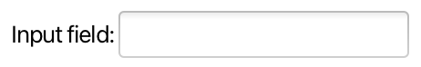

# Rich Text Area (Incubator)

Andy Goryachev

<andy.goryachev@oracle.com>


## Summary

Provide a RichTextArea control for displaying and editing of rich text that can be styled in a variety of ways.


## Goals

Out of the box, the **RichTextArea** control provides support for a number of common use cases:

- a simple editor similar to WordPad or TextEdit level, suitable for note taking or message editing
- view-only presentation of rich text information (help pages, documentation, etc.)
- an editor which supports large (~2B rows), virtualized models
- an editor which combines rich text with interactive content, such as a code notebook
- a code editor with syntax highlighting
- enable custom key mappings
- enable limited extension via custom models, attributes, and side decorations


## Non-Goals

The following list represents features RichTextArea does not support:

- models with arbitrarily long (e.g., 10K+ symbols) paragraphs
- applications requiring arbitrary text/graphics positioning
- desktop publishing application that require precise control of text appearance
- non-contiguous selection
- tabular-formatted text


## Motivation

JavaFX lacks a dedicated rich text area control, resulting in a functional gap in relation to Swing with its StyledEditorKit/JEditorPane.  

The new RichTextArea control intends to bridge this gap by providing a dedicated control for displaying and editing rich text.

The main design goal is to provide a control that is complete enough to be useful out-of-the box, as well as open to extension by the application developers.  The benefit of providing such a control as a part of the core platform is not just adding support for rich text, but also in taking care of many intricate details required for such support, making it easier for third party developers who decide to extend the basic functionality.

Creating a simple editable control should be as easy as this:

```java
        RichTextArea t = new RichTextArea();
```

Creating a view-only informational control should also be easy:

```java
        SimpleViewOnlyStyledModel m = new SimpleViewOnlyStyledModel();
        // add text segment using CSS style name (requires a style sheet)
        m.addSegment("RichTextArea ", null, "HEADER");
        // add text segment using direct style
        m.addSegment("Demo", "-fx-font-size:200%;", null);
        // newline
        m.nl();

        RichTextArea t = new RichTextArea(m);
```


## Description

Two new controls are provided: **RichTextArea** and **CodeArea**.  RichTextArea works with styled text and embedded Nodes, whereas CodeArea is limited to plain text documents using single font, which allows for syntax highlighting.

The data model (document) is separated from the control, allowing for greater flexibility.  **EditableRichTextModel** is a default model for RichTextArea, **CodeTextModel** is a default model for CodeArea.

The following diagram illustrates the logical relationships between important classes:

```
RichTextArea                   control
 ├─ TextPos                    immutable text position
 ├─ SelectionSegment           single selection segment (two markers)
 │   └─ Marker                 moveable text position within the document
 │
 ├─ StyledTextModel            document data model
 │   ├─ RichParagraph          presents the paragraph contents to view
 │   │   ├─ StyleAttrs         immutable map of style attributes 
 │   │   ├─ StyledSegment      immutable styled segment
 │   └─ DataFormatHandler      converter for import/export/clipboard operations
 │       ├─ StyledInput        input stream of StyledSegments
 │       ├─ StyledOutput       output stream of StyledSegments
 │       └─ StyleResolver      converts external CSS styles to attributes
 │
 └─ RichTextAreaSkin           default skin
     └─SideDecorator           right/left paragraph decorator factory
```

CodeArea extends RichTextArea and brings a few additional classes into the picture:

```
CodeArea                       control, extends RichTextArea
 ├─ CodeTextModel              document model, extends PlainTextModel, extends StyledTextModel
 └─ SyntaxDecorator            interface which provides styling for underlying plain text
```

We intend to deliver this feature in an incubating module, **javafx.incubator.controls**.
While this document makes an attempt to give an overview of various parts, please refer to the
[API Specification](https://cr.openjdk.org/~angorya/RichTextArea/javadoc/) for more detail.


### Design Features

- paragraph-oriented model, up to ~2 billion rows
- virtualized text cell flow
- supports text styling with an application stylesheet or inline attributes
- supports multiple views connected to the same model
- single selection
- input map allows for easy behavior extension


### RichTextArea Properties

The new **RichTextArea** control exposes the following properties:

|Property                   |Description                                                                 |Styleable|
|:--------------------------|:---------------------------------------------------------------------------|:--------|
|anchorPosition             |provides the anchor position (read-only)	
|caretBlinkPeriod           |determines the caret blink period	
|caretPosition              |provides the caret position (read-only)	
|contentPadding             |defines the amount of padding in the content area                           |Yes
|displayCaret               |indicates whether the caret is displayed	
|editable                   |indicates whether the editing is enabled	
|highlightCurrentParagraph  |indicates whether the current paragraph is highlighted
|leftDecorator              |specifies the left side paragraph decorator
|model                      |document data model	
|rightDecorator             |specifies the right side paragraph decorator
|selection                  |tracks the selection (read-only)
|useContentHeight           |determines whether the preferred height is the same as the content height
|useContentWidth            |determines whether the preferred width is the same as the content width
|wrapText                   |indicates whether text should be wrapped                                    |Yes


### Model

The RichTextArea control separates data model from the view by providing the **model** property.

The base class for any data model is **StyledTextModel**.  This abstract class provides no data storage, focusing instead on providing common functionality to the actual models, such as dealing with styled segments, keeping track of markers, sending events, etc.


#### Standard Models

A number of standard models are provided, each designed for a specific use case.  The following table illustrates the standard models' class hierarchy:

|Class Name                             |Description                                    |
|:--------------------------------------|:----------------------------------------------|
|`StyledTextModel`                      |Base class (abstract)
|` ├─ EditableRichTextModel`            |Default model for RichTextArea
|` ├─ PlainTextModel`                   |Unstyled plain text model
|` │   └─ CodeTextModel`                |Default model for CodeArea
|` └─ StyledTextModelViewOnlyBase`      |Base class for a view-only model (abstract)
|`     └─ SimpleViewOnlyStyledModel`    |In-memory view-only styled model

The **EditableRichTextModel** stores the data in memory, in the form of text segments styled with attributes defined in **StyleAttrs** class.  This is a default model for RichTextArea.

The **PlainTextModel** could be used as a base class for in-memory text models based on plain text.  This class provides foundation for the **CodeTextModel**, which styles the text using a pluggable **SyntaxDecorator**.

The abstract **StyledTextModelViewOnlyBase** is a base class for immutable models.  This class is used by **SimpleViewOnlyStyledModel** which simplifies building of in-memory view-only styled documents.

Please refer to [Extensibility](#extensibility) section for more information.


### Skin

The default skin, implemented by the **RichTextAreaSkin** class, provides the visual representation of RichTextArea control (i.e. represents a "View" in the MVC paradigm).

The main feature of the default skin is a virtualized text flow, where only a small number of paragraphs are laid out, enabling visualization and editing of large models.  In addition to paragraphs visible in the viewport, some number of paragraphs before and after the visible area are also laid out, forming a sliding window.  This allows for more precise scrolling experience and when the scrolling amount is measured in pixels (such as page up / page down).


#### Selection

RichTextArea control maintains a single contiguous selection segment, ultimately linked with the View, to enable multiple controls working off the same data model to have their own selection.

Selection is represented by the **selectionSegment** property, a part of **SelectionModel**.  Even though RichTextArea exposes **anchorPositionProperty** and **caretPositionProperty** individually, the latter two are considered derivative (and updated after the selectionSegment property when selection changes).  Selection segment uses the **Marker** class which updates the actual position in the presence of edits (such as edits made by the user in another view, or by a background process).

Two sets of convenience methods simplify programmatic setting of the selection segment: one that sets both caret and anchor positions, and the other that extends selection from the anchor position to the (new) caret.

These methods update both the anchor and the caret positions: 

- void **clearSelection**()
- void **select**(TextPos)
- void **select**(TextPos anchor, TextPos caret)
- void **selectAll**()

The following methods extend selection from the existing anchor position to the new caret position.  When no anchor exists, the methods are reduced to setting the anchor to be the same as the caret position:

- void **extendSelection**(TextPos)
- void **selectToDocumentEnd**()
- void **selectToDocumentStart**()
- void **selectDown**()
- void **selectEndOfNextWord**()
- void **selectLeft**()
- void **selectLeftWord**()
- void **selectNextWord**()
- void **selectPageDown**()
- void **selectPageUp**()
- void **selectParagraph**()
- void **selectPreviousWord**()
- void **selectRight**()
- void **selectRightWord**()
- void **selectUp**()
- void **selectWord**()


### Behavior

RichTextArea control utilizes the new capabilities offered by the new **InputMap** feature.  In this design, the control exposes a number of function tags identifying the public methods that convey the behavior.  There is one public method per each function tag, allowing for customization of the behavior when required.

The table below lists the available function tags:

|Function Tag              |Description     |
|:-------------------------|:---------------|
|BACKSPACE                 |Deletes the symbol before the caret
|COPY                      |Copies selected text to the clipboard
|CUT                       |Cuts selected text and places it to the clipboard
|DELETE                    |Deletes the symbol at the caret
|DELETE_PARAGRAPH          |Deletes paragraph at the caret, or selected paragraphs
|INSERT_LINE_BREAK         |Inserts a line break at the caret
|INSERT_TAB                |Inserts a tab symbol at the caret
|MOVE_DOWN                 |Moves the caret one visual line down
|MOVE_LEFT                 |Moves the caret one symbol to the left
|MOVE_RIGHT                |Moves the caret one symbol to the right
|MOVE_TO_DOCUMENT_END      |Moves the caret to after the last character of the text
|MOVE_TO_DOCUMENT_START    |Moves the caret to before the first character of the text
|MOVE_TO_PARAGRAPH_END     |Moves the caret to the end of the paragraph at caret
|MOVE_TO_PARAGRAPH_START   |Moves the caret to the beginning of the paragraph at caret
|MOVE_UP                   |Moves the caret one visual text line up
|MOVE_WORD_LEFT            |Moves the caret one word left (previous word if LTR, next word if RTL)
|MOVE_WORD_NEXT            |Moves the caret to the beginning of next word
|MOVE_WORD_NEXT_END        |Moves the caret to the end of the next word
|MOVE_WORD_PREVIOUS        |Moves the caret to the beginning of previous word
|MOVE_WORD_RIGHT           |Moves the caret one word right (next word if LTR, previous word if RTL)
|PAGE_DOWN                 |Moves the caret one visual page down
|PAGE_UP                   |Moves the caret one visual page up
|PASTE                     |Pastes the clipboard content
|PASTE_PLAIN_TEXT          |Pastes the plain text clipboard content
|REDO                      |If possible, redoes the last undone modification
|SELECT_ALL                |Selects all text in the document
|SELECT_DOWN               |Extends selection one visual text line down
|SELECT_LEFT               |Extends selection one symbol to the left
|SELECT_PAGE_DOWN          |Extends selection one visible page down
|SELECT_PAGE_UP            |Extends selection one visible page up
|SELECT_PARAGRAPH          |Selects the current paragraph
|SELECT_RIGHT              |Extends selection one symbol to the right
|SELECT_TO_DOCUMENT_END    |Extends selection to the end of the document
|SELECT_TO_DOCUMENT_START  |Extends selection to the start of the document
|SELECT_UP                 |Extends selection one visual text line up
|SELECT_WORD               |Selects a word at the caret position
|SELECT_WORD_LEFT          |Extends selection to the previous word (LTR) or next word (RTL)
|SELECT_WORD_NEXT          |Extends selection to the beginning of next word
|SELECT_WORD_NEXT_END      |Extends selection to the end of next word
|SELECT_WORD_PREVIOUS      |Extends selection to the previous word
|SELECT_WORD_RIGHT         |Extends selection to the next word (LTR) or previous word (RTL)
|UNDO                      |If possible, undoes the last modification

These functions and the key mappings can be customized using the control's **InputMap**.


### CodeArea Control

CodeArea extends RichTextArea control to provide a styled text based on a plain text data model coupled with a **SyntaxDecorator**.


#### CodeArea Properties

CodeArea adds a few properties in addition to the existing properties declared by the RichTextArea control:

|Property       |Description                                           |Styleable|
|:--------------|:-----------------------------------------------------|:--------|
|font           |the default font                                      |Yes
|lineNumbers    |determines whether to show line numbers
|lineSpacing    |defines the vertical space in pixels between lines    |Yes
|tabSize        |the size of tab stop in spaces                        |Yes


#### CodeTextModel 

CodeArea uses **CodeTextModel** - a dedicated editable, in-memory, plain text model which uses its **decorator** property to style the text.

The function of a decorator, which implements the **SyntaxDecorator** interface, is to embellish the plain text contained in the model with colors and font styles, using the font provided by the control.


#### Editing

RichTextArea provides a number of convenience methods for editing the content programmatically:

- TextPos **appendText**(String text, StyleAttrs)
- TextPos **appendText**(StyledInput)
- void **applyStyle**(TextPos start, TextPos end, StyleAttrs)
- void **clear**()
- TextPos **insertText**(TexPos start, String, StyleAttrs)
- TextPos **insertText**(TextPos start, StyledInput)
- TextPos **replaceText**(TextPos start, TextPos end, String text, boolean allowUndo)
- TextPos **replaceText**(TextPos start, TextPos end, StyledInput, boolean allowUndo)
- void **setStyle**(TextPos start, TextPos end, StyleAttrs)

The following example illustrates how to populate an editable RichTextArea programmatically:

```java
        // create styles
        StyleAttrs heading = StyleAttrs.builder().setBold(true).setFontSize(24).build();
        StyleAttrs plain = StyleAttrs.builder().setFontFamily("Monospaced").build();

        RichTextArea rta = new RichTextArea();
        // build the content
        rta.appendText("Heading\n", heading);
        rta.appendText("Plain monospaced text.\n", plain);
```

All the content modifications are eventually channeled through two methods in the StyledTextModel:

- void **applyStyle**(TextPos start, TextPos end, StyleAttrs, boolean mergeAttributes)
- void **replace**(StyleResolver, TextPos start, TextPos end, StyledInput, boolean createUndo)

Once the model applies the changes, a corresponding event is broadcast to all the listeners registered with the model - one such listener is the skin, which in turn updates the scene graph by requesting new RichParagraphs within the affected range of text.


##### Undo / Redo

RichTextArea supports undo/redo.  The following methods deal with undo/redo stack:

- void **clearUndoRedo**()
- boolean **isRedoable**()
- boolean **isUndoable**()
- void **redo**()
- void **undo**()


The actual undo/redo stack is stored in the StyledTextModel.
The model therefore provides a similar set of methods for accessing the undo/redo stack:

- void **clearUndoRedo**()
- boolean **isRedoable**()
- boolean **isUndoable**()
- void **redo**(StyleResolver)
- void **undo**(StyleResolver)


### Clipboard

The StyledTextModel provides capability to copy to and paste from the system clipboard in a variety of formats.  Several implementations are provided, all extending the **DataFormatHandler** class:

|Format                             |Implementation                 |Export |Import |
|:----------------------------------|:------------------------------|:------|:------|
|DataFormat.HTML                    |**HtmlExportFormatHandler**    |yes    |no
|DataFormat.PLAIN_TEXT              |**PlainTextFormatHandler**     |yes    |yes
|RichTextFormatHandler.DATA_FORMAT  |**RichTextFormatHandler**      |yes    |yes
|DataFormat.RTF                     |**RtfFormatHandler**           |yes    |yes (limited)

The default model, EditableRichTextModel, copies plain text, HTML, RTF, as well as an internal format.  It also supports pasting plain text, internally formatted data, and a limited support for RTF.


### Customization

RichTextArea allows for some degree of customization without subclassing.  The application developer can alter the control behavior by:

- mapping a new key binding to an external function
- redefining existing key bindings
- redefining the functions corresponding to function tags (including the public methods in the control)
- setting left and right side paragraph decorators
- providing custom scroll bars via **ConfigurationParameters**


#### Mapping a New Key Binding to an External Function

This example illustrates adding a new key binding (Shortcut-W), mapped to a new function, applied to a specific instance of RichTextArea:

```java
        // creates a new key binding mapped to an external function
        richTextArea.getInputMap().registerKey(KeyBinding.shortcut(KeyCode.W), () -> {
            System.out.println("console!");
        });
```


#### Redefining Existing Key Binding

This example illustrates unbinding all existing key bindings, followed by registering a new key binding mapped to the same function:

```java
        // unbind old key bindings
        var old = richTextArea.getInputMap().getKeyBindingsFor(RichTextArea.PASTE_PLAIN_TEXT);
        for (KeyBinding k : old) {
            richTextArea.getInputMap().unbind(k);
        }
        // map a new key binding
        richTextArea.getInputMap().registerKey(KeyBinding.shortcut(KeyCode.W), RichTextArea.PASTE_PLAIN_TEXT);
```


#### Redefining Function Mapped to an Existing Function Tag

This example illustrates how to modify a function mapped to a function tag.
The existing key mapping will automatically use the new behavior.
The modified mapping can also be reverted back to its original behavior.

For example, the application might offer an alternative way to navigate over words using the keyboard:

```java
        // redefine a function
        richTextArea.getInputMap().registerFunction(RichTextArea.MOVE_WORD_NEXT, () -> {
            // apply alternative navigation logic
            TextPos p = getCustomNextWordPosition(richTextArea);
            richTextArea.select(p);
        });

        // revert back to the default behavior
        richTextArea.getInputMap().restoreDefaultFunction(RichTextArea.MOVE_WORD_NEXT);
```


#### Setting Side Decorators

This example illustrates how to set a side paragraph decorator (in this case, a LineNumberDecorator):

```java
        // sets a side decorator
        richTextArea.setLeftDecorator(new LineNumberDecorator());
```


#### Providing Custom Scroll Bars

In this example, a custom scroll bar will be used by the RichTextArea:

```java
        // sets a custom vertical scroll bar
        ConfigurationParameters cp = ConfigurationParameters.
            builder().
            verticalScrollBar(ScrollBar::new).
            build();
        RichTextArea richTextArea = new RichTextArea(cp, null);
```


### Extensibility

While RichTextArea should be useful enough out-of-the-box, it is designed with extensibility in mind.  The application developers can extend the functionality by:

- extending the model
- adding new data format handlers, or replacing the default ones
- adding support for new attributes to the model
- extending the RIchTextArea class and adding new function tags and corresponding public methods 


#### Extending the Model

A typical use case for extending one of the standard models is to interface with a data source: a file, a stream, or some other kind of data generated on the fly.  The choice of class to be extended is determined by whether the data can be changed by the application, whether the model is allowed to be editable by the user, and whether the data will be stored by the model in memory.  Most likely, however, the application developer would need to extend the base class - StyledTextModel.


##### View-Only Models

A view-only model can be used to present rich text document not editable by the user (for example, a help or an informational page, or a virtualized view backed by a large file).

**SimpleViewOnlyStyledModel** is suitable for a small in-memory styled document.  This model provides a number of methods to populate the document one segment at a time:

- SimpleViewOnlyStyledModel **addSegment**(String text)
- SimpleViewOnlyStyledModel **addSegment**(String text, String style, String ... styleNames)
- SimpleViewOnlyStyledModel **addSegment**(String text, StyleAttrs)

Other methods allow for adding image paragraphs, embedded Nodes, paragraph containing a single Region, as well as various types of highlights:

- SimpleViewOnlyStyledModel **addImage**(InputStream)
- SimpleViewOnlyStyledModel **addNodeSegment**(Supplier<Node>)
- SimpleViewOnlyStyledModel **addParagraph**(Supplier<Region>)
- SimpleViewOnlyStyledModel **highlight**(int start, int length, Color)
- SimpleViewOnlyStyledModel **nl**()
- SimpleViewOnlyStyledModel **nl**(int)
- SimpleViewOnlyStyledModel **setParagraphAttributes**(StyleAttrs)
- SimpleViewOnlyStyledModel **squiggly**(int start, int length, Color)

An example of how to pre-populate the SimpleViewOnlyStyledModel is provided in the "Motivation" section.

The abstract base class **StyledTextModelViewOnlyBase** can be used in circumstances when the data is either too large to be stored in memory (such as backed by a large file), or where data is generated on the fly.

In this case, three abstract methods must be implemented:

- int **size**()
- String **getPlainText**(int)
- RichParagraph **getParagraph**(int) 


##### Creating a Paragraph

The model returns an instance of **RichParagraph** from its **getParagraph**(int) method.  A RichParagraph represents a paragraph with rich text.  As an immutable class, it has to be built using the **RichParagraph.Builder** which offers a number of methods which help construct and style the content:

- Builder **addHighlight**(int start, int length, Color) 
- Builder **addInlineNode**(Supplier<Node>)
- Builder **addSegment**(String text)
- Builder **addSegment**(String text, String inlineStyle, String[] styles)
- Builder **addSegment**(String text, StyleAttrs)
- Builder **addSquiggly**(int start, int length, Color)
- Builder **setParagraphAttributes**(StyleAttrs)

The following example illustrates how to use RichParagraph.Builder to build a paragraph that looks like this:


```java
            StyleAttrs a1 = StyleAttrs.builder().setBold(true).build();
            RichParagraph.Builder b = RichParagraph.builder();
            b.addSegment("Example: ", a1);
            b.addSegment("spelling, highlights");
            b.addSquiggly(9, 8, Color.RED);
            b.addHighlight(19, 4, Color.rgb(255, 128, 128, 0.5));
            b.addHighlight(20, 7, Color.rgb(128, 255, 128, 0.5));
            return b.build();
```


##### Embedded Nodes

A RichParagraph may contains inline Nodes, or can represent a single Rectangle.  The model must not retain references to any Nodes because it may be shared between multiple RichTextAreas.  The use of a Supplier pattern allows the model to create the nodes specific to the view where they will be presented.

The embedded Nodes and Rectangles also can be Controls and handle user input.  Doing so might require addition of properties to the model, bidirectionally bound with the corresponding properties in the embedded Controls.  This way a change in one view gets propagated to other views connected to the same model.

The model must also provide [export/import](#export-and-import) of these properties values in order to preserve the user input.

The following example provides an example using a single TextField, which looks like this:



```java
public class ExamplesModel extends StyledTextModelViewOnlyBase {
    /** stores the user input from the embedded TextArea */
    private final SimpleStringProperty exampleProperty = new SimpleStringProperty();

    @Override
    public RichParagraph getParagraph(int index) {
        switch(index) {
        case 0: // this model contains a single paragraph
            RichParagraph.Builder b = RichParagraph.builder();
            b.addSegment("Input field: ");
            // creates an embedded control bound to a property within this model
            b.addInlineNode(() -> {
               TextField t = new TextField();
               t.textProperty().bindBidirectional(exampleProperty);
               return t;
            });
            return b.build();
        }
        return null;
    }
    ...
}
```


##### Styling

There are two ways of styling text in RichTextArea: either using inline attributes, or relying on style names in the application style sheet.

It is important to understand the limitation of stylesheet approach as it is only suitable for view-only models because editing of styles by the user is not possible when styles come from the application stylesheet (and might be dynamically changed by the application).  Using stylesheet's names also necessitates the use of **StyleResolver** in order to obtain the actual attribute values when they are needed (for instance, when exporting).  And since the stylesheet might specify totally different styles for different RichTextAreas, the visual rendering and the exported attributes might differ, even when both controls are connected to the same model.

This example illustrates how to style a view-only document created with the SimpleViewOnlyStyledModel and an application stylesheet:

```java
        SimpleViewOnlyStyledModel m = new SimpleViewOnlyStyledModel();
        // add text segment using CSS style name (requires a style sheet)
        m.addSegment("RichTextArea ", null, "HEADER");
        // add text segment using direct style
        m.addSegment("Demo", "-fx-font-size:200%;", null);
        // newline
        m.nl();
```

The default model for RichTextArea, the EditableRichTextModel, uses a number of style attributes (found in StyleAttrs class).  These attributes are applicable either to the whole paragraph (BACKGROUND, BULLET, FIRST_LINE_INDENT, ...) or to the individual text segments (BOLD, FONT_FAMILY, etc.).


#### Export And Import

StyledTextModel provides a common mechanism for importing/exporting styled text into/from the model via the following methods:

- void **export**(TextPos start, TextPos end, StyledOutput out)
- TextPos **replace**(StyleResolver, TextPos start, TextPos end, String text, boolean allowUndo)
- TextPos **replace**(StyleResolver, TextPos start, TextPos end, StyledInput in, boolean allowUndo)

The I/O interfaces **StyledInput** and **StyledOutput** provide the transport mechanism based on streaming of individual **StyledSegment**s.


#### Adding Export / Import Format Handlers

Custom models may offer support for other data formats, or improve support for existing ones.  The following methods in StyledTextModel allow to register, remove, or query the data formats supported by the model:

- DataFormat[] **getSupportedDataFormats**(boolean forExport)
- void **registerDataFormatHandler**(DataFormatHandler, boolean forExport, boolean forImport, int priority)
- void **removeDataFormatHandler**(DataFormat, boolean forExport, boolean forImport)
  
At the control level, the following methods transfer the entire contents of the control in any format supported by the model:

- void **read**(InputStream)
- void **read**(DataFormat, InputStream)
- void **write**(OutputStream)
- void **write**(DataFormat, OutputStream)


#### Adding New Attributes

At the core of converting the style attributes in the model to the visual representation is a **StyleHandlerRegistry**.  This registry contains code (see **StyleAttributeHandler** interface) which applies the inline styles on either Text node for the text segment attributes (or TextFlow node for the paragraph attributes) during the process of rendering of document content by the skin.

Because this process is linked to a skin, the registry is contained in the control.  Adding support for a new attribute therefore requires extending RichTextArea:

1. declare the new StyledAttribute
2. create a StyleAttributeHandler which will provide the inline style(s)
3. extend RichTextArea and initialize the new StyleHandlerRegistry instance for the class, combining the parent class registry and the new handler(s)

In the below example, based on the CodeArea class, two new style attributes, FONT and TAB_SIZE are declared to be used by the skin to render fontProperty and tabSizeProperty in the control:

```java
public class CodeArea extends RichTextArea {
    static final StyleAttribute<Font> FONT = new StyleAttribute<>("CodeArea.FONT", Font.class, false);
    static final StyleAttribute<Integer> TAB_SIZE = new StyleAttribute<>("CodeArea.TAB_SIZE", Integer.class, true);

    /** The style handler registry instance. */
    protected static final StyleHandlerRegistry styleHandlerRegistry = initStyleHandlerRegistry();
    
    @Override
    public StyleHandlerRegistry getStyleHandlerRegistry() {
        return styleHandlerRegistry;
    }

    private static StyleHandlerRegistry initStyleHandlerRegistry() {
        StyleHandlerRegistry.Builder b = StyleHandlerRegistry.builder(RichTextArea.styleHandlerRegistry);

        // this paragraph attribute affects each segment
        b.setSegHandler(CodeArea.FONT, (c, cx, v) -> {
            String family = v.getFamily();
            double size = v.getSize();
            cx.addStyle("-fx-font-family:'" + family + "';");
            cx.addStyle("-fx-font-size:" + size + ";");
        });

        b.setParHandler(CodeArea.TAB_SIZE, (c, cx, v) -> {
            if (v > 0) {
                cx.addStyle("-fx-tab-size:" + v + ";");
            }
        });

        return b.build();
    }
```


#### Adding New Function Tags

When extending RichTextArea, it might be necessary to allow for adding user-configurable key bindings mapped to some new functionality.

Doing so requires the following steps:

1. declaring a new FunctionTag
2. creating a new public method in RichTextArea that calls execute() with the newly added FunctionTag
3. creating a method that implements the new functionality
4. registering the new function tag and key bindings

This example illustrates the process:

```
    public class MyControl extends RichTextArea {
        // function tag allows the user to customize key bindings
        public static final FunctionTag MY_TAG = new FunctionTag();

        public MyControl() {
            // register custom functionality with the input map
            getInputMap().registerFunction(MY_TAG, this::newFunctionImpl);
            // create a key binding
            getInputMap().registerKey(KeyBinding.shortcut(KeyCode.W), MY_TAG);
        }

        private void newFunctionImpl() {
            // custom functionality
        }
    }
```

NOTE: this process also works without extending the RichTextArea, if the custom functionality requires only the public APIs.


## Alternatives

Do not provide a RichTextArea control as a core part of JavaFX.  
A number of existing open source projects already provide some rich text capability:

- https://github.com/FXMisc/RichTextFX
- https://github.com/gluonhq/rich-text-area
- https://github.com/andy-goryachev/FxEditor


## Testing

Extensive tests, headless where possible, should be developed.  These tests should exercise every function, every key binding, ideally every condition that affects the behavior, similarly to [JDK-8314906](https://bugs.openjdk.org/browse/JDK-8314906).

Two manual test applications are provided - one for RichTextArea (**RichTextAreaDemoApp**)
and one for the CodeArea (**CodeAreaDemoApp**).

In addition to these two testers, a small example provides a standalone rich text editor, see **RichEditorDemoApp**.


## Risks and Assumptions

TBD


## Dependencies

This enhancement depends on the following enhancements:

- [JDK-8314968](https://bugs.openjdk.org/browse/JDK-8314968) Public InputMap
- [Behavior / InputMap Proposal](https://github.com/andy-goryachev-oracle/Test/blob/ag.jep.behavior.v1/doc/InputMap/BehaviorInputMapProposal.md) (Incubator)
- [JDK-8314482](https://bugs.openjdk.org/browse/JDK-8314482) Tab stop policy

