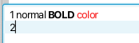
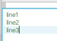

# Rich Text Area (Incubator) Data Format

Version 2 (2025/05/20)

Andy Goryachev

<andy.goryachev@oracle.com>


## Summary

This document describes the data format used by `RichTextArea`'s default text model `RichTextModel`
for saving/loading/copying/pasting of the rich text.


## Example

As an example, the following rich text



is represented by the following file:

```
{}1 normal {b}BOLD{} {tc|FF0000}color{!}
2{!}
```


## Description

The document is represented as a text file in UTF-8 encoding, each paragraph separated by a single `LF` symbol:

```
(<PARAGRAPH><LF>)[]
```

A paragraph is a list of zero or more text segments, followed by the optional paragraph attributes:

```
PARAGRAPH: {
  TEXT_SEGMENT[]
  PARAGRAPH_ATTRIBUTES
}
```

Each text segment consists of one or more character attributes, followed by the text.  The text may contain
escape symbols:

```
TEXT_SEGMENT: {
  CHARACTER_ATTRIBUTE[]
  text
}
```

Each character attribute is enclosed in curly braces, and contains either the attribute name, or the attribute name
with a value separated by the `|` symbol:

```
CHARACTER_ATTRIBUTE: {name}
CHARACTER_ATTRIBUTE: {name|value}
```

An empty attribute is represented by `{}` and indicates the beginning of the next text segment.

Each paragraph might be followed by one or more paragraph attributes:

```
PARAGRAPH_ATTRIBUTE: {!name}
PARAGRAPH_ATTRIBUTE: {!name|value}
```

A special token `{!}` indicates that the paragraph contains no attributes.


### Text Escapes

The following characters found in the text are escaped using `%XX` sequence where `XX` is a hexadecimal representation
of the character: `{`, `%`, `}`.


### Style Compression

To avoid repeating the same attributes over and over, the format employs a form of compression, where the duplicate
attributes are replaced by special tokens:

```
CHARACTER_ATTRIBUTE_LOOKUP: {number}
PARAGRAPH_ATTRIBUTE_LOOKUP: {!number}
```

where `number` is the index of the duplicate attribute map in the document. 

Example:



```
{tc|4D804D}line1{!}
{0}line2{!}
{0}line3{!}
```


## Character Attributes

|Name    |StyleAttributeMap     |Type        |Comments                                                      |
|:-------|:---------------------|:-----------|:-------------------------------------------------------------|
|b       |BOLD                  |boolean     |
|ff      |FONT_FAMILY           |String      |
|fs      |FONT_SIZE             |double      |
|i       |ITALIC                |boolean     |
|ss      |STRIKE_THROUGH        |boolean     |
|tc      |TEXT_COLOR            |Color       |6 hex digits `RRGGBB`.  Example: `{tc&#x007c;4D804D}`
|u       |UNDERLINE             |boolean     |


## Paragraph Attributes

|Name         |StyleAttributeMap                                                           |
|:------------|:---------------------------------------------------------------------------|
|alignment    |TEXT_ALIGNMENT
|bg           |BACKGROUND
|bullet       |BULLET
|dir          |PARAGRAPH_DIRECTION
|firstIndent  |FIRST_LINE_INDENT
|lineSpacing  |LINE_SPACING
|spaceAbove   |SPACE_ABOVE
|spaceBelow   |SPACE_BELOW
|spaceLeft    |SPACE_LEFT
|spaceRight   |SPACE_RIGHT

