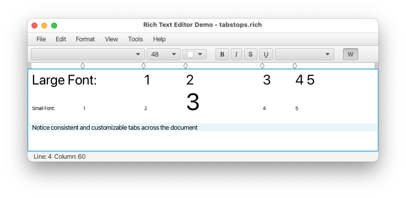

# Tab Stop Policy

Andy Goryachev

<andy.goryachev@oracle.com>


## Summary

Introduce a `tabStopPolicy` property in the `TextFlow` class which, when set, overrides the existing `tabSize`
value and provides consistent way of setting tab stops at the paragraph level, regardless of the individual text
segments font [0].




## Goals

The goal of this proposal is to provide a better way for controlling tab stops in the `TextFlow` containing rich text.


## Non-Goals

The following are not the goals of this proposal:

- support for tab stop types (BAR, or DECIMAL), or attributes like `alignment`
- support the `leader` property (symbols to fill the empty space before the tab stop)
- support for `firstLineIndent` property
- deprecate the `TextFlow::tabsize` property


## Motivation

The existing `tabSize` property in the `TextFlow` is inadequate for representing tab stops when the content
contains text with different font sizes.

In addition to that, a rich text editor might require support for user-customizable tab stops, similar to that provided
in RTF or MS Word documents.


## Description

### javafx.scene.text.TextFlow

```java
	      * The size of a tab stop in spaces.
	      * Values less than 1 are treated as 1. This value overrides the
	      * {@code tabSize} of contained {@link Text} nodes.
	+     * <p>
	+     * Note that this method should not be used to control the tab placement when multiple {@code Text} nodes
	+     * with different fonts are contained within this {@code TextFlow}.
	+     * In this case, {@link #setTabStopPolicy(TabStopPolicy)} should be used instead.

	+    /**
	+     * Determines the tab stop positions within this {@code TextFlow}.
	+     * <p>
	+     * A non-null {@code TabStopPolicy} overrides values set by {@link #setTabSize(int)},
	+     * as well as any values set by {@link Text#setTabSize(int)} in individual {@code Text} instances within
	+     * this {@code TextFlow}.
	+     *
	+     * @defaultValue null
	+     *
	+     * @since 25
	+     */
	+    public final ObjectProperty<TabStopPolicy> tabStopPolicyProperty()
	+
	+    public final TabStopPolicy getTabStopPolicy()
	+
	+    public final void setTabStopPolicy(TabStopPolicy policy)
	
	    /**
	     * The size of a tab stop in spaces.
	     * Values less than 1 are treated as 1. This value overrides the
	     * {@code tabSize} of contained {@link Text} nodes.
	+    * <p>
	+    * Note that this method should not be used to control the tab placement when multiple {@code Text} nodes
	+    * with different fonts are contained within this {@code TextFlow}.
	+    * In this case, {@link #setTabStopPolicy(TabStopPolicy)} should be used instead.
	     *
	     * @defaultValue 8
	     *
	     * @since 14
	     */
	    public final IntegerProperty tabSizeProperty()
```


### javafx.scene.text.TabStopPolicy

```java
	+/**
	+ * The TabStopPolicy determines the tab stop positions within the text layout.
	+ *
	+ * @since 25
	+ */
	+public final class TabStopPolicy {
	+
	+    /**
	+     * Constructs a new {@code TabStopPolicy} instance, with an empty list of stops.
	+     */
	+    public TabStopPolicy()
	+
	+    /**
	+     * The list of tab stops.
	+     *
	+     * @return the non-null list of tab stops
	+     */
	+    public final ObservableList<TabStop> tabStops() 
	+
	+    /**
	+     * Specifies the default tab stop interval for tabs beyond the last stop provided
	+     * by {@link #tabStops()}.  This is a fixed repeating distance (in pixels) to the
	+     * next tab stop computed at regular intervals relative to the leading edge
	+     * of the {@code TextFlow} node.
	+     * <p>
	+     * A value of less than or equal 0 disables the default interval.
	+     *
	+     * @return the default tab interval property
	+     * @defaultValue 0
	+     */
	+    public final DoubleProperty defaultIntervalProperty() 
	+
	+    public final double getDefaultInterval()
	+
	+    public final void setDefaultInterval(double value)
```

### javafx.scene.text.TabStop

```java
	+/**
	+ * This class encapsulates an immutable single tab stop within the {@link TabStopPolicy}.
	+ *
	+ * @since 25
	+ */
	+public final class TabStop {
	+
	+    /**
	+     * Constructs a new tab stop with the specified position.
	+     *
	+     * @param position the position in pixels
	+     */
	+    public TabStop(double position) {
	+        this.position = position;
	+    }
	+
	+    /**
	+     * Returns the position, in pixels, of the tab.
	+     * @return the position of the tab
	+     */
	+    public final double getPosition()
```


## Alternatives

None known.


## Risks and Assumptions

Possible incompatibility with custom controls which extend `TextFlow` and declare a property with the same name. 


## Dependencies

None.


## References

0. [JDK-8314482](https://bugs.openjdk.org/browse/JDK-8314482)
1. https://github.com/andy-goryachev-oracle/Test/blob/main/doc/TabStopPolicy/TabStopPolicy.md
